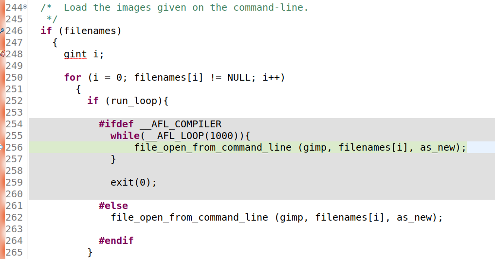

前几个月把fuzzing lab的几个练习做了一下，做GIMP时无意中挖到了一个0day，这里记录一下做练习中遇到的坑，等CVE下来了再和大家分享一下这个0day

#### 0x1 插桩编译GIMP

```c++

NM=nm PKG_CONFIG_PATH="/home/bytes/Desktop/fuzzing_lab/fuzzing_gimp/install/lib/x86_64-linux-gnu/pkgconfig/:/home/bytes/Desktop/fuzzing_lab/fuzzing_gimp/install/lib/pkgconfig/" CC=afl-clang-fast CXX=afl-clang-fast++ ./configure prefix=/home/bytes/Desktop/fuzzing_lab/fuzzing_gimp/install

AFL_USE_ASAN=1 make

```
使用**afl-clang-fast**和**afl-clang-fast**进行插桩，并开启ASAN

编译完成后一定要记得删除GIMP中插件，其中有些插件在运行时会报错，并影响GIMP的运行


#### 0x2 设置persistent mode
为了提高fuzzing的速度，需要设置afl++为持久化模式，在设置了persistent mode时需要添加`exit`函数，不添加的情况下会在使用console模式时卡住，导致fuzz的test都超时





#### 0x3 fuzzing&crash 分析
多开几个实例，大概一晚上可以出crash


下面就是跑出的crash，其中一个就是CVE-2016-4994，还有两个应该也是这个附近的cve id


