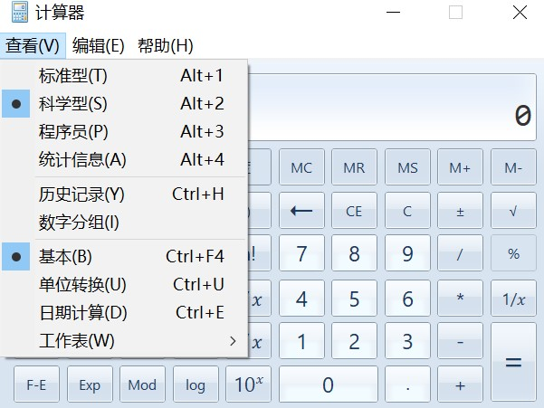
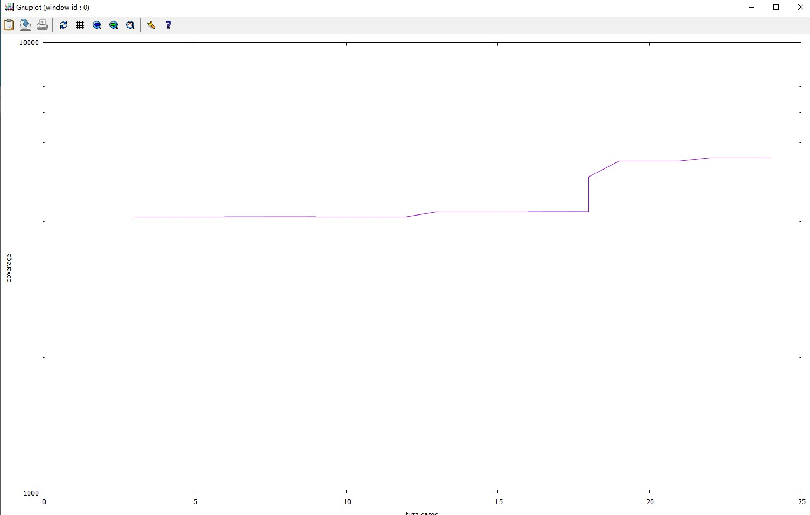

### 1 再次分析win32calc

#### 1.1 优化进程的附加方式

在前一篇文章中我们通过窗口的title找到计算器，然后用`SetForegroundWindow`函数来聚焦，最后再对当前的窗体发送消息，这其中有个很大的问题就是每次只能Fuzz一个计算器，而且当前机器上还不能有其他的窗体名为计算器，为了能够并发的Fuzz多个计算器，我们需要优化一下我们的附加策略---通过PID进行附加

```rust
#[derive(Default, Clone, Copy)]
pub struct Window{
    pub hwnd : HWND
}

//我这个版本的windows api并没有给HWND实现Debug这个trait
impl fmt::Debug for Window {
    fn fmt(&self, f: &mut fmt::Formatter<'_>) -> fmt::Result {
        write!(f, "Window {{hwnd : {:?}, title: \"{}\"}}", self.hwnd , self.get_windowtext().unwrap())
    }
}

...

// 回调，通过PID确定计算器的句柄
unsafe extern "system" fn enum_windows_handler(hwnd: HWND, lparam: LPARAM) -> BOOL {
       let param = &mut * (lparam.0 as *mut (u32, Option<HWND>));

       let mut pid = 0;
       let tid = GetWindowThreadProcessId(hwnd, &mut pid);

       assert!(pid != 0 && tid != 0);
       if param.0 == pid {
           if param.1.is_none() {
            param.1 = Some(hwnd);
           }
       }
       
       true.into()
    }

// 枚举HWND，并通过回调函数确定PID对应的句柄，之后我们的各种
// 操作都将针对HWND来进行
pub fn attach_pid(pid: u32) -> Result<Self, io::Error>{ 
        let mut context: (u32, Option<HWND>) = (pid, None);
        unsafe{
            if !EnumWindows(Some(Self::enum_windows_handler),
             LPARAM(&mut context as *mut _ as isize)).as_bool() {
                return Err(io::Error::last_os_error())
            }
        }
        if let Some(hwnd) = context.1 {
            Ok(Window { hwnd })
        }else {
            Err(io::Error::new(io::ErrorKind::Other, "Could not find HWND for pid"))
        }
        
    }

```
#### 1.2 分析win32calc的输入

在实现dumb Fuzzer时我们选择的输入的实现方式是在获取计算器句柄后给当前的窗口发送一些随机的键盘消息，虽然我们使用了黑名单来过滤掉一些无用的消息，但是实际上产生有效输入的过程还是低效的

为了获得高效的输入，再次分析win32calc，通过spy++可以发现win32calc中的每一个Button实际上都是有句柄的


实际上我们可以通过枚举计算器窗口的所有句柄，然后随机的选取各个button，之后对获取的button发送鼠标左键消息，这样我们产生的所有输入都将是有效的

#### 1.3 枚举win32calc的各种模式

除了对计算器的每个button发送鼠标左键消息外，我们还需要能够切换计算器的不同模式



这里实际上可以通过menu相关的api来枚举menu id，同时我们还要枚举子menu的menu最后给对应的menu id发送comman消息就能实现随机的模式切换，通过递归很容易能实现枚举所有的menu id

#### 1.4 实现Fuzzer的generator

下面是我们的smart Fuzzer的generator部分

```rust
// FuzzerAction就是我们设计的输入，实现成枚举类型，方便后续
// 的各种操作
#[derive(Clone, Copy, Debug, PartialEq, Eq, PartialOrd, Ord, Hash)]
pub enum FuzzerAction {
    LeftClickEvent {idx: usize},
    CloseEvent,
    MenuAction {menu_id: u32}
}

...

pub fn generator(pid: u32) -> Result<Vec<FuzzerAction>, Box<dyn Error>>{
    // 记录一次输入产生了哪些action
    let mut actions = Vec::new();

    // 产生随机数
    let rng = Rng::new();

    loop{
        // 附加到计算器进程
        let primary_window = Window::attach_pid(pid);
    
        ...

        // 枚举计算器窗体中的子窗体
        let sub_windows = primary_window.enumerate_subwindows();
       
       ...

        // 随机的选取子窗体
        let sel = rng.rand() % sub_windows.len();
        let window = sub_windows[sel];

        // 给选择的子窗体发送鼠标左键消息，并记录在actions中
        actions.push(FuzzerAction::LeftClickEvent {idx: sel});
        let _ = window.left_click(None);

        // 1/0x1000 的概率直接关闭当前的计算器
        if rng.rand() & 0xfff == 0 {
            actions.push(FuzzerAction::CloseEvent); 
            let _ = primary_window.close();
            return Ok(actions)
        }
        
        // 1/0x20 的概率切换计算器的模式 
        if rng.rand() & 0x1f == 0 {
            // 枚举menu，并给随机的sub menu发送command消息
            if let Ok(menus) = primary_window.enum_menu(){
                let menus = Vec::from_iter( menus.iter().cloned());
                

                let sel = menus[rng.rand() % menus.len()];
                actions.push(FuzzerAction::MenuAction { menu_id: sel });
                let _ = primary_window.use_menuid(sel);

                // 测试发现给sub menu发送消息后必须要sleep
                // 否则直接error
                std::thread::sleep(Duration::from_millis(10));
            }
        }
    }
}

...
// sub windows的实现
#[derive(Default, Debug)]
pub struct WindowListing {
    windows: Vec<Window>
}

impl Deref for WindowListing {
    type Target = [Window];
    fn deref(&self) -> &Self::Target {
        &self.windows
    }
}

// 回调，返回当前模式下的所有子窗体，注意不同
// 模式下的子窗体是不同的，程序员模式的计算器
// 就比标准模式下的计算器多很多子窗体
unsafe extern "system" fn enum_child_window_callback(hwnd: HWND, lparam: LPARAM) -> BOOL {
    let listing: &mut WindowListing = &mut *(lparam.0 as *mut WindowListing);
    listing.windows.push(Window { hwnd });
    true.into()
}

// 枚举当前计算器的子窗体
pub fn enumerate_subwindows(&self) -> Result<WindowListing, io::Error>{
    let mut listing = WindowListing::default();
    unsafe {
        if bool::from(EnumChildWindows(self.hwnd,
                Some(Self::enum_child_window_callback),
                LPARAM(&mut listing as *mut WindowListing as isize))) {
            Ok(listing)
        }else {
            Err(io::Error::last_os_error())
        }
    }    
}

...

// 递归的枚举menu以及子menu
fn recurse_menu(&self, menu_ids: &mut BTreeSet<u32>, menu_handle: HMENU)-> Result<(), io::Error> {
    unsafe{
        let menu_count = GetMenuItemCount(menu_handle);
        if menu_count == -1 {
            return Err(io::Error::last_os_error());
        }

        for menu_index in 0..menu_count {
            let menu_id = GetMenuItemID(menu_handle, menu_index);
            if menu_id == !0 {
                // 如果是有子menu的
                let sub_menu = GetSubMenu(menu_handle, menu_index);
                if sub_menu.0 == 0 {
                    return Err(io::Error::last_os_error());
                }
                self.recurse_menu(menu_ids, sub_menu)?
            } else {
                // 将所有的menu都存在集合中
                menu_ids.insert(menu_id);
            }
        }
    }
    Ok(())
}

// 枚举所有menu
pub fn enum_menu(&self) -> Result<BTreeSet<u32>, io::Error> {
    unsafe{
        let menu = GetMenu(self.hwnd);
        if menu.0 == 0 {
            return Err(io::Error::last_os_error())
        }
        
        let mut menu_ids = BTreeSet::<u32>::new();
        self.recurse_menu(&mut menu_ids, menu)?;
        Ok(menu_ids)
    }
}


...
// 给窗体发送对应的消息，给PostMessageW使用
enum  MessageType{
    LButtonDown = 0x201,
    LButtonUP = 0x202,
    Command =   0x0111,
    Close   = 0x0010 
}

// 给对应的menu发送Command命令
pub fn use_menuid(&self, menu_id :u32) -> Result<(), io::Error> {
    unsafe{
        if PostMessageW(self.hwnd, MessageType::Command as _, 
            WPARAM(menu_id as _), LPARAM(0)).as_bool(){
                Ok(())
        }else {
            Err(io::Error::last_os_error())
        }
    }
}


// 给对应的子窗体发送鼠标左键消息
pub fn left_click(&self, state: Option<KeyMouseState>)->Result<(), io::Error> {

        ...

        if !PostMessageW(self.hwnd, MessageType::LButtonDown as u32,
                wparam, LPARAM(0)).as_bool(){
                return Err(io::Error::last_os_error())
        } 

        if !PostMessageW(self.hwnd, MessageType::LButtonUP as u32,
            wparam, LPARAM(0)).as_bool(){
                return Err(io::Error::last_os_error())
        } 
    }
    Ok(())
}

// 关闭当前的计算器实例
pub fn close(&self) -> Result<(), io::Error> {
    unsafe{
        if PostMessageW(self.hwnd, MessageType::Close as _, 
            WPARAM(0), LPARAM(0)).as_bool(){
                Ok(())
        }else {
            Err(io::Error::last_os_error())
        }
    }
}

```

### 2 获取win32calc的代码覆盖率以及crash信息
windows下收集代码覆盖率的工具有如下这些


这里我们使用的mesos来辅助我们来获得代码覆盖率
mesos实际上是一个Rust写的dbg，通过IDA或bninja的脚本我们可以导出目标的basic block的信息，在运行时通过bb信息以及INT 3断点来获得实时的覆盖率，当目标进程crash时会自动dump，优点是上手简单，缺点是不能获得边的覆盖率

#### 2.1 修改mesos源码

为了将mesos集成到Fuzzer中，我们需要修改一些mesos的源码
首先是代码覆盖率部分

```rust
    pub struct Debugger<'a> {
    
    ...

    // 将coverage 数据库声明为pub，方便我们来获取
    // 覆盖率信息
    pub coverage: HashMap<usize, (Arc<String>, usize, String, u64)>,

    ...
}

```

其次是为了能获得crash信息，我们需要在debugger中添加一些代码

```rust
// 实现退出和Crash时的返回结构，Exit对应的代码，Crash返回
// 生产的dump文件
#[derive(Clone, Debug, PartialEq, Eq)]
pub enum ExitType {
    ExitCode(i32),
    Crash(String)
}

...

// 之后根据dbg的状态设置返回值为ExitCode还是Crash
if EXIT_REQUESTED.load(Ordering::SeqCst) {
    // Exit out of the run loop
    return ExitType::ExitCode(0);
}

// ExceptionCode为0xc0000005时返回Crash信息
 if exception.ExceptionRecord.ExceptionCode ==
    0xc0000005 {
                        
...

    // Exit out
    return
        ExitType::Crash(filename);

...

```

#### 2.2 实现代码覆盖率逻辑

为了方便管理覆盖率相关的信息，我们先设计一下会用到的数据结构

```rust
// 一次generator产生的所有FuzzerAction
type FuzzInput = Vec<FuzzerAction>;

#[derive(Default, Clone)]
pub struct Statistics {
    // 对计算器进行了几轮输入
    pub fuzz_cases: u64,

    // 代码覆盖率 <(模块名， 地址)， 对应的FuzzerAction数组>
    pub coverage_db: HashMap<(Arc<String>, usize), FuzzInput>,

    // 所有的FuzzInput
    pub input_db: HashSet<FuzzInput>,

    // 所有的FuzzInput还包括顺序
    pub input_list: Vec<FuzzInput>
}

```

添加代码覆盖率的核心逻辑

```rust
    let mut local_stats = Statistics::default();

    ...

    let mut coverage = HashMap::new();
    std::mem::swap(&mut dbg.coverage, &mut coverage);

    ...
    
    for (_, (moudle, offset, _, _)) in coverage.iter(){
        let key = (moudle.clone(), *offset);
        if !local_stats.coverage_db.contains_key(&key) {
            // coverage数据库中如果没有对应的bb信息就添加进去
            local_stats.input_db.insert(fuzz_input.clone());
            local_stats.coverage_db.insert(key.clone(),
            fuzz_input.clone());    
        }
    }

    local_stats.fuzz_cases += 1;   

```

上面的大部分逻辑放在一个loop中，当我们给计算器发送各种消息一轮后，程序就会更新我们的coverage_db数据库，用来统计新的输入命中了多少新的basic block，通过覆盖率的变化，我们可以来修改后面mutator的实现来让Fuzzer更加高效

#### 2.3 实现crash信息收集的逻辑

这里我们再向数据库中添加一些字段

```rust
#[derive(Default, Clone)]
pub struct Statistics {
    // 对计算器进行了几轮输入
    pub fuzz_cases: u64,

    // 代码覆盖率 <(模块名， 地址)， 对应的FuzzerAction数组>
    pub coverage_db: HashMap<(Arc<String>, usize), FuzzInput>,

    // 所有的FuzzInput
    pub input_db: HashSet<FuzzInput>,

    // 所有的FuzzInput还包括顺序
    pub input_list: Vec<FuzzInput>

    // crash 个数
    pub crashes: u64,

    // crash 对应的dump名以及对应的输入(方便漏洞复现)
    pub crash_db: HashMap<String, FuzzInput>
}

...

let exit_stat = dbg.run();

...

if let ExitType::Crash(crashname) = exit_stat{
    local_stats.crashes += 1;

    local_stats.crash_db.insert(crashname.clone(), fuzz_input.clone());
```

### 3 实现多线程和多线程版的代码覆盖率

为了实现多线程帮助我们同时Fuzz多个计算器实例，我们首先应该再次修改数据结构的设计，其次就是将Fuzz的核心代码包装在一个函数中，这样我们就能通过`spawn`函数轻松的进行多线程Fuzzing了

```rust
// 多线程版本的FuzzInput
type FuzzInput = Arc<Vec<FuzzerAction>>;

// 主要的工作函数
fn worker(stats: Arc<Mutex<Statistics>>){
    let mut local_stats = Statistics::default();
    let rng = Rng::new();
    
    loop{
       
       ...

        // 启动计算器
        let mut dbg = Debugger::spawn_proc(&[r"c:\windows\system32\win32calc.exe".into()], false);

        // 加载mesos文件
        mesofile::load_meso(&mut dbg, Path::new("win32calc.exe.meso"));

        ...

        let exit_stat = dbg.run();

        let _ = dbg.kill();
        let mut coverage = HashMap::new();
        std::mem::swap(&mut dbg.coverage, &mut coverage);

       ... 

        for (_, (moudle, offset, _, _)) in coverage.iter(){
            let key = (moudle.clone(), *offset);
            if !local_stats.coverage_db.contains_key(&key) {
                local_stats.input_db.insert(fuzz_input.clone());
                local_stats.coverage_db.insert(key.clone(),
              fuzz_input.clone());
                
                // 获取全局的数据信息
                let mut stats = stats.lock().unwrap();
                if !stats.coverage_db.contains_key(&key) {
                    // 将覆盖率信息保存到全局的数据库中
                    if stats.input_db.insert(fuzz_input.clone()) {
                        stats.input_list.push(fuzz_input.clone());

                        for &action in fuzz_input.iter(){
                            if stats.unique_action_set.insert(action) {
                                stats.unique_actions.push(action)
                            }
                        }
                    }
                    stats.coverage_db.insert(key.clone(),
                  fuzz_input.clone());
                }
            }
        }

        let mut stats = stats.lock().unwrap();

        local_stats.fuzz_cases += 1;   
        stats.fuzz_cases += 1; 

        // 将crash信息保存到本地数据库和全局的数据库中
        if let ExitType::Crash(crashname) = exit_stat{
            local_stats.crashes += 1;
            stats.crashes += 1;

            local_stats.crash_db.insert(crashname.clone(), fuzz_input.clone());
            stats.crash_db.insert(crashname.clone(), fuzz_input.clone());
        }
    }
}

...
// main 函数中的逻辑
fn main() {
    // 汇总所有实例的各种信息，local_stats单独记录
    // 当前的实例的信息
    let stats = Arc::new(Mutex::new(Statistics::default()));
    
    ...

    // 三个Fuzz计算器的实例
    for _ in 0..3 {
        let stats = stats.clone();
        std::thread::spawn(move || {
            worker(stats);
        });

    }

}
 
```

至此我们已经能够并发的Fuzz计算器并将crash自动保存了，现在还差最后一项就是实现mutator

### 4 实现mutator并对Fuzzer进行评估

mutator也是在worker函数的使用，可以从下面的代码看到Fuzzer是随机的选择是generator和mutator，其中有1/0x9的概率执行generator,其他情况下都是执行mutator，当然现在这个概率并不是固定的，我们后续需要通过评估来选择一个更合理的数值来让代码覆盖率的变化更加的高效

```rust
let thr = {
        let pid = dbg.pid;
        let generate = (rng.rand() & 0x8) == 0;
        let stats = stats.clone();
        std::thread::spawn(move || {
            std::thread::sleep(std::time::Duration::from_millis(3000));
            
            // Get access to the global stats database
            if generate ||  stats.lock().unwrap().input_db.len() == 0{
                // fuzz traget proc
                generator(pid).expect("Error on generator")
            }else {
                let mutated = mutate(stats).expect("Error on generator");
                perform_actions(pid ,&mutated).expect("Failed to perform actions");
                mutated
            }
        })
    };
```

下面是mutator的具体实现，我们的突变策略有三种，一是从所有action中随机的挑选一段action删掉，这里的action是所有曾经出现过的action，保存在unique_actions中。另一种是取随机的一段action，计算器再次按照这一系列的action执行一遍，最后就是插入重复的一段action。

```rust
pub fn mutator(stats: Arc<Mutex<Statistics>>) -> Result<Vec<FuzzerAction>, Box<dyn Error>>{
   
   ...

    for _ in 0..((rng.rand() & 0xf) + 1) {
        let sel = rng.rand() % 3;
        match sel {
            0 => {
                // 删除随机的action
                let start = rng.rand() % input.len();
                let length = rng.rand() % (rng.rand() % 32 + 1);
                let end = std::cmp::min(start + length, input.len());
                input.splice(start..end, []);
            }
            1 => {

                let start = rng.rand() % input.len();
                let length = rng.rand() % (rng.rand() % 32 + 1);
                let end = std::cmp::min(start + length, input.len());

                // 选择随机的一段action
                let donor_input = &stats.unique_actions;
                let donor_start = rng.rand() % donor_input.len();
                let donor_length =  rng.rand() % (rng.rand() % 32 + 1);
                let donor_end =  std::cmp::min(donor_start + donor_length, donor_input.len());

                input.splice(start..end, 
                    donor_input[donor_start..donor_end].iter().cloned());
            }
            2 => {
                // 插入重复的action
                let sel = rng.rand() % input.len();
                for _ in 0..rng.rand() % (rng.rand() % 128 + 1) {
                    input.insert(sel, input[sel]);
                }
            }
            _ => panic!("Unreachable")
        }
    }

    Ok(input)
}
```

这里的所有随机数和对应的概率都需要我们利用代码覆盖率来进行优化，我们可以输出一些值来方便图形化，从而直观的观察如何修改各种策略的概率会相应的提高代码覆盖率




### 5 其他

最后让我们来看看在20s内都有Fuzz到了哪些Crash


另外不知道大家有没有看今年的bluehat，其中的Hyper-V Fuzzer在实现上和我们这里的思路其实大同小异，有兴趣的话可以学习一下下面的slides,然后通过她的攻击面分析用mesos写一个Hyper-V的Fuzzer出来

slides: https://github.com/0xdidu/Presentations/blob/main/BHIL2022_Hyntrospect.pdf
